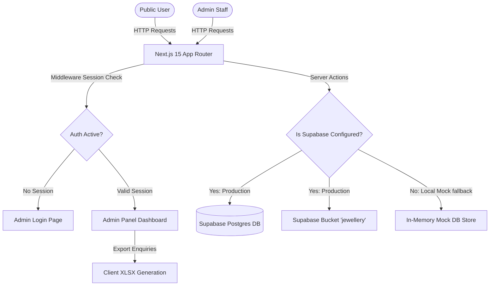

# Codebase Summary: Anand Jewellers (Labh Abhushan) Showroom App

This document provides a comprehensive technical overview of the **Anand Jewellers (Labh Abhushan) Showroom Web Application**. It acts as a guide to understand the system architecture, database layout, file structure, security configurations, and key data flows.

---

## 🌟 1. System Architecture Overview

The application is built on a modern **Next.js 15 (App Router)** frontend paired with a **Supabase** backend. It features a unique **dual-mode mechanism** designed to support both local development/offline testing and standard cloud deployment.



### Key Architectural Decisions
1. **Server Actions (Next.js 15)**: Used exclusively for all database mutations and reads (Products, Categories, Rates, Banners, Enquiries). This keeps database connection strings and logic safe on the server side.
2. **In-Memory Fallback Store**: If Supabase environment variables are missing or set to defaults (`your-project-id`), the server actions redirect operations to a mock database store ([mockDb.ts](file:///d:/website/src/lib/actions/mockDb.ts)). This allows instantly testing the entire application UI without setting up a backend.
3. **Cookie-based Session Validation**: All authenticated routes under `/admin/*` are verified using Next.js Middleware. Authentication status is evaluated using Supabase SSR Session handling.

---

## 🗄️ 2. Database Design & Schema

The PostgreSQL schema is defined in [schema.sql](file:///d:/website/schema.sql) and is structured as follows:

| Table Name | Description | Key Fields & Constraints |
| :--- | :--- | :--- |
| **`categories`** | Organizes the collection (e.g., Gold, Silver, Diamonds). | `id` (UUID, PK), `name` (Text, Unique, Not Null) |
| **`products`** | Stores detail metadata for each item. | `id` (UUID, PK), `category_id` (FK -> categories, Cascade), `product_name` (Text, Not Null), `weight` (Numeric, e.g., 48.550g), `purity` (Text), `image_url` (Text), `images` (Text[] for secondary image carousels), `featured` (Boolean), `status` (Text Check: 'Available' or 'Out of Stock') |
| **`metal_rates`** | Holds current daily gold and silver showroom rates. | `id` (Integer PK, Check: `id = 1` for single-row enforcement), `gold_rate` (Numeric), `silver_rate` (Numeric), `updated_at` (Timestamp) |
| **`banners`** | Keeps active sliding banners for the homepage hero. | `id` (UUID, PK), `title` (Text), `image_url` (Text), `active` (Boolean) |
| **`enquiries`** | Contains submissions from the contact form and item drawer. | `id` (UUID, PK), `name` (Text), `mobile` (Text), `email` (Text, Nullable), `message` (Text) |

### 🔒 Row Level Security (RLS) Policies
Each table has strict security policies implemented directly at the database level:
* **Categories, Products, Metal Rates, and Banners**:
  * **Public Access**: Allowed to `SELECT` (read) all records.
  * **Staff/Admin Access**: Allowed to insert, update, or delete only if `authenticated` via Supabase Auth.
* **Enquiries**:
  * **Public Access**: Allowed to `INSERT` submissions (writing enquiries from the public contact/details pages).
  * **Staff/Admin Access**: Allowed all operations (`SELECT`, `INSERT`, `DELETE`) only if `authenticated`.

---

## 📁 3. Directory Layout & File Guide

Below is a map of the important directories and files in the repository:

### ⚙️ Root Configuration
* [`package.json`](file:///d:/website/package.json): Manages project scripts (`dev`, `build`, `lint`) and dependencies such as `next`, `react`, `@supabase/ssr`, `xlsx`, and `tailwindcss` (v4).
* [`schema.sql`](file:///d:/website/schema.sql): PostgreSQL script to initialize tables, row security constraints, and default seeding in the Supabase SQL editor.
* [`.env.local`](file:///d:/website/.env.local): Configuration for Supabase keys (`NEXT_PUBLIC_SUPABASE_URL`, `NEXT_PUBLIC_SUPABASE_ANON_KEY`).

### 📦 Source (`src/`)

#### 🗺️ Routes & Pages (`src/app/`)
* [`layout.tsx`](file:///d:/website/src/app/layout.tsx): Configures site-wide typography (Outfit & Playfair Display fonts), themes, the public navbar, and footer.
* [`page.tsx`](file:///d:/website/src/app/page.tsx): Main homepage, displaying the hero banner carousel, real-time gold/silver rates widget, featured ornaments grid, customer reviews, and showroom locator map.
* [`about/page.tsx`](file:///d:/website/src/app/about/page.tsx): Details the brand's heritage, buyback guarantees, and quality certifications.
* [`products/page.tsx`](file:///d:/website/src/app/products/page.tsx): Paginated product catalog search page with real-time text filter and category-based sorting.
* [`products/[id]/page.tsx`](file:///d:/website/src/app/products/%5Bid%5D/page.tsx): High-detail product viewer supporting multiple image previews, detailed weights, purities, and a WhatsApp action trigger.
* [`contact/page.tsx`](file:///d:/website/src/app/contact/page.tsx): General showroom communication page displaying phone numbers, maps, and a form to submit enquiries.
* **Admin Pages (`src/app/admin/`)**:
  * [`login/page.tsx`](file:///d:/website/src/app/admin/login/page.tsx): Authentication page for authorized employees.
  * [`dashboard/page.tsx`](file:///d:/website/src/app/admin/dashboard/page.tsx): Analytics hub displaying counts of active items, new enquiries, and category totals.
  * [`products/page.tsx`](file:///d:/website/src/app/admin/products/page.tsx): Administration page for product inventory management (creates, reads, updates, deletes).
  * [`categories/page.tsx`](file:///d:/website/src/app/admin/categories/page.tsx): Allows editing or adding category sections inline.
  * [`rates/page.tsx`](file:///d:/website/src/app/admin/rates/page.tsx): Interface to submit daily gold/silver rates to the database.
  * [`banners/page.tsx`](file:///d:/website/src/app/admin/banners/page.tsx): Management of active advertising banners.
  * [`enquiries/page.tsx`](file:///d:/website/src/app/admin/enquiries/page.tsx): Read-only listing of incoming customer requests with filters and spreadsheet download tools.
* [`middleware.ts`](file:///d:/website/src/middleware.ts): Redirects unauthorized traffic away from `/admin` panels unless authenticated.

#### 🧩 Components (`src/components/`)
* [`navbar.tsx`](file:///d:/website/src/components/navbar.tsx): Mobile-responsive layout carrying core store coordinates and WhatsApp links. Dismisses itself when visiting admin routes.
* [`footer.tsx`](file:///d:/website/src/components/footer.tsx): Public bottom footer containing showroom timings and contact links.
* [`admin-sidebar.tsx`](file:///d:/website/src/components/admin-sidebar.tsx): Floating control navigation menu for staff accounts.
* [`hero-carousel.tsx`](file:///d:/website/src/components/hero-carousel.tsx): Custom interval image slider presenting hero ads.
* [`product-details-client.tsx`](file:///d:/website/src/components/product-details-client.tsx) & [`product-image-gallery.tsx`](file:///d:/website/src/components/product-image-gallery.tsx): Interactive client logic to handle full-size image switches and tabs on details page.
* [`product-enquiry-modal.tsx`](file:///d:/website/src/components/product-enquiry-modal.tsx): Popup form drawer enabling customers to submit inquiries directly for a specific ornament.

#### 🔧 Core Database & Utilities (`src/lib/`)
* **Supabase Configuration (`src/lib/supabase/`)**:
  * [`client.ts`](file:///d:/website/src/lib/supabase/client.ts): Exposes the client browser instance for client-side interactions.
  * [`server.ts`](file:///d:/website/src/lib/supabase/server.ts): Exposes server client factories that handle automatic reading/writing of auth cookies inside server nodes.
  * [`middleware.ts`](file:///d:/website/src/lib/supabase/middleware.ts): Main interceptor logic managing routing permissions.
  * [`storage.ts`](file:///d:/website/src/lib/supabase/storage.ts): Custom utility parsing binary images out of Base64 strings to store in the Supabase public `'jewellery'` bucket.
* **Server Actions (`src/lib/actions/`)**:
  * [`rates.ts`](file:///d:/website/src/lib/actions/rates.ts): Exposes [getMetalRates](file:///d:/website/src/lib/actions/rates.ts#L7) and [updateMetalRates](file:///d:/website/src/lib/actions/rates.ts#L35). Revalidates cache of the root homepage (`/`).
  * [`products.ts`](file:///d:/website/src/lib/actions/products.ts): Handles paginated query filtering, additions ([createProduct](file:///d:/website/src/lib/actions/products.ts#L111)), updates, and deletions of ornaments.
  * [`categories.ts`](file:///d:/website/src/lib/actions/categories.ts): CRUD operations for catalog categories. Revalidates the page routes.
  * [`banners.ts`](file:///d:/website/src/lib/actions/banners.ts): Supports creating, deleting, and toggling banner states. Removes images from the physical storage bucket on delete actions.
  * [`enquiries.ts`](file:///d:/website/src/lib/actions/enquiries.ts): Manages guest submissions and staff deletes.
  * [`mockDb.ts`](file:///d:/website/src/lib/actions/mockDb.ts): Self-contained, in-memory state engine hosting initial items, dummy leads, and categories when offline.
* [`utils.ts`](file:///d:/website/src/lib/utils.ts): Helper for conditional class name merging (`cn`).

---

## 🔄 4. Detailed Data Flows

### A. Customer Enquiries & Lead Acquisition
```
1. Customer clicks "Enquire on WhatsApp" -> Prefilled WA message created with product link and weight.
2. Customer completes the Details Drawer Form or Contact Page:
   a. Input validation runs (Name, Mobile, Message required).
   b. Server Action "createEnquiry" is called.
   c. Records are added to the 'enquiries' table (or mockDb).
   d. Admin cache is revalidated (revalidatePath('/admin/dashboard'), etc.).
```

### B. Admin Image Upload Pipeline
This application handles uploads smoothly using pure Server Actions by converting images to Base64 buffers:
```
1. Admin selects a file in the form (Primary or Additional images).
2. Client-side FileReader converts the files into Base64 strings.
3. Form submits. Server Action "createProduct" or "createBanner" receives the strings.
4. Server parses the header (e.g. data:image/png;base64) -> extracts contentType (MIME) and file extension.
5. Node Buffer.from(cleanBase64, 'base64') generates binary data.
6. The client uploads the buffer to the 'jewellery' storage bucket on Supabase.
7. Supabase returns the public URL, which is written to the 'image_url' or 'images' columns in the DB.
```

### C. Metal Rates Dynamic Cache Updating
Daily pricing changes are handled with high caching efficiency:
```
1. Admin updates the rates under "/admin/rates" -> updateMetalRates(goldPrice, silverPrice).
2. The upsert operation targets ID = 1 (enforcing single-row pricing rules).
3. The server calls Next.js "revalidatePath('/')".
4. The homepage layout gets updated on the spot. Static visitor page cache updates with the latest pricing.
```

### D. Session Verification flow
```
1. Visitor requests "/admin/dashboard".
2. Middleware interceptor runs.
3. Supabase Auth reads the authentication token from incoming request cookies.
4. If no valid session is found (and it isn't /admin/login):
   -> Redirect to /admin/login.
5. If a session is valid and the user tries to load /admin/login:
   -> Redirect to /admin/dashboard.
```

---

## 🛠️ 5. Key Local Testing & Setup Commands

To run or test this codebase locally, use these commands:

```bash
# 1. Install project dependencies
npm install

# 2. Start the hot-reloading development server
npm run dev

# 3. Build optimized production packages with Turbopack compiler
npm run build

# 4. Start production server locally
npm run start

# 5. Run static lint checks on source files
npm run lint
```

> [!NOTE]
> If Supabase database connection variables (`NEXT_PUBLIC_SUPABASE_URL`) are omitted in `.env.local` or match default placeholding values, the system automatically uses the local mock engine. Authentication can be mocked by typing credentials in `/admin/login` which sets a local `mock-session=true` cookie.
